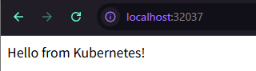
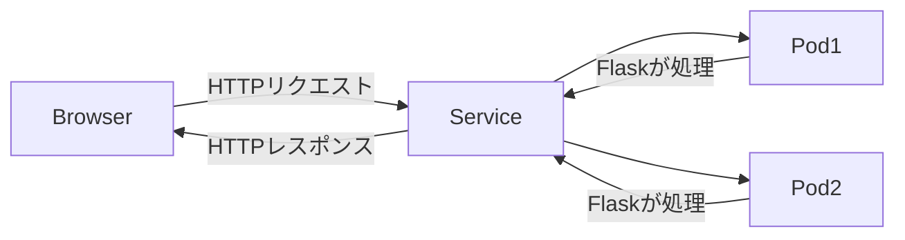
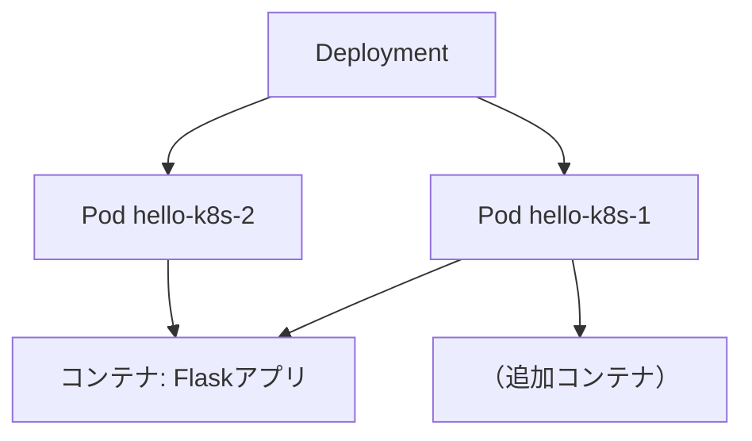

# Kubernetesとは？

## 基本の役割
**たくさんのコンテナをまとめて管理するシステム（オーケストレーションツール）**

- 大規模サービスになると、コンテナが何百・何千と必要になる  
  → 1個1個を手で起動・監視・修復するのは不可能  

- Kubernetesはそれを自動でやってくれる  
  - コンテナの起動・停止・再起動  
  - 負荷に応じた自動スケール  
  - 障害発生時の自動復旧  
  - 複数サーバーに分散配置  

👉 例えるなら：  
**Kubernetesは「大規模フードコートの店長」**  
- Dockerが作った料理（コンテナ）をお客さん（ユーザー）に途切れなく提供  
- 調理担当を割り振り、在庫（サーバー）を管理し、足りなければ人員（コンテナ）を増やす  

---

## DockerとKubernetesの比較

| 項目   | Docker        | Kubernetes                 |
| ------ | ------------- | -------------------------- |
| 主な役割 | コンテナを作成・実行    | コンテナを管理・調整                 |
| 規模   | 単体アプリや小規模向け   | 大規模システムや商用サービス向け           |
| 機能   | コンテナ化、配布、単純実行 | スケーリング、自動復旧、ロードバランス、サービス発見 |
| イメージ | **コンテナ職人**    | **コンテナ指揮者**                |

---

## Kubernetesの仕組み

- **Pod** = コンテナの実行単位  
- **Deployment** = コンテナを何個動かすか管理  
- **Service** = 外部からの入り口（ロードバランサー的役割）

```
iniad@localhost:~/Kubernetes-dev/hello-k8s$ kubectl apply -f k8s/
deployment.apps/hello-k8s created
service/hello-k8s-service created
```

```
iniad@localhost:~/Kubernetes-dev/hello-k8s$ kubectl get pods
NAME                         READY   STATUS    RESTARTS   AGE
hello-k8s-7968796dbb-5ck94   1/1     Running   0          40s
hello-k8s-7968796dbb-fgkb7   1/1     Running   0          40s
```

```
iniad@localhost:~/Kubernetes-dev/hello-k8s$ kubectl get svc
NAME                TYPE        CLUSTER-IP      EXTERNAL-IP   PORT(S)        AGE
hello-k8s-service   NodePort    10.104.150.69   <none>        80:32037/TCP   49s
kubernetes          ClusterIP   10.96.0.1       <none>        443/TCP        99s
```





## サイトにアクセスしたら何が動くのか？

今回のセットアップ（Hello Kubernetes! アプリ）では、以下の流れで処理されます。

---

### 処理のステップ

1️⃣ **ブラウザがリクエスト**  
例: `http://localhost:32037/` にアクセス  
→ HTTPリクエストが送信される  

2️⃣ **Kubernetes Service が受け取る**  
- NodePort Service がリクエストを受ける  
- 「どのPodに渡すか」を負荷分散（ラウンドロビンなど）で決定  

3️⃣ **Pod のコンテナが処理**  
- 選ばれたPod内のコンテナ（Flaskアプリ）がリクエストを受け取る  
- Flask の `@app.route("/")` が呼ばれ、文字列 `"Hello from Kubernetes!"` を生成  

4️⃣ **レスポンスが返る**  
- Pod → Service → ブラウザ  
- ブラウザに `"Hello from Kubernetes!"` が表示される  

5️⃣ **裏側で Kubernetes がやっていること**  
- 複数Podがあれば **負荷分散**  
- リクエストごとに違うPodに振り分け  
- Podが落ちても **自動再起動**  
- Deployment が **Pod数を常に維持**  
- PodのIPは変わっても、**Service経由ならユーザーは意識不要**

---

### アーキテクチャ図（Mermaid）




ポイント

- Kubernetesを使うと、ユーザーは どのPodが処理しているか意識せず にアクセスできる
- Podが落ちても自動で復旧し、ユーザーには影響なし
- 複数サービスや複雑なルーティングも同じ仕組みで処理可能


P# ✅ Podとは？

## 基本
- **Pod = Kubernetesの最小実行単位**
- 「1個以上のコンテナをまとめた箱」のような存在
- Podの中にコンテナを1つでも複数でも入れられる
- Kubernetesは **Pod単位で管理・スケーリング・復旧** を行う

---

## 1️⃣ 例えると
- **Dockerだけ** → コンテナ1個を直接起動して使う  
- **Kubernetes** → 「コンテナを入れる箱（Pod）」を作り、その箱ごと管理する  

Podの中には以下が含まれる：  
- コンテナ  
- ストレージボリューム  
- ネットワークIP  

---

## 2️⃣ Podの特徴
- **1つのPod = 同じIP / ネットワーク空間**  
  → Pod内の複数コンテナは `localhost` で通信可能  

- **短命な存在**  
  → Pod自体は一時的で、消えて作り直されるのが前提  

- **上位リソースによる管理**  
  → Deploymentなどが「必要数を維持」してくれる  
  → ユーザーは基本的に **Podを直接触らず、Deployment経由で管理**  


👉 まとめると、**Podは「Kubernetesがコンテナを動かすための最小ユニット」**であり、ユーザーはDeploymentやServiceを通じて扱うことが一般的。




## Pod自動復旧ミニ実験


```
iniad@localhost:~/Kubernetes-dev/hello-k8s$ kubectl get pods
NAME                         READY   STATUS    RESTARTS   AGE
hello-k8s-7968796dbb-5ck94   1/1     Running   0          40s
hello-k8s-7968796dbb-fgkb7   1/1     Running   0          40s
```

### Podをわざと削除

Podを消しても、Deployment が自動で新しいPodを作ります
```
iniad@localhost:~/Kubernetes-dev/hello-k8s$ kubectl delete pod hello-k8s-7968796dbb-fgkb7
pod "hello-k8s-7968796dbb-fgkb7" deleted
```

状態を確認

```
iniad@localhost:~/Kubernetes-dev/hello-k8s$ kubectl get pods -w
NAME                         READY   STATUS    RESTARTS   AGE
hello-k8s-7968796dbb-5ck94   1/1     Running   0          10m
hello-k8s-7968796dbb-cw24k   1/1     Running   0          32s
```

新しいPod（cw24k）が自動で立ち上がっていることが分かります。


# ✅ ブラウザでアクセスしてみる

- NodePort経由で `http://localhost:30007/` にアクセス  
- 削除前と同じく **"Hello from Kubernetes!"** が表示される  
- 👉 Podを削除してもユーザーには影響なし  

---

## 学べること
- **Deployment** が Podの数を常に維持してくれる  
- Podが落ちても **自動で再作成される**  
- **Service経由でアクセス**する限り、ユーザーはPodの状態を意識せず利用できる  

---

## 🔄 自動復旧の仕組み
1. **Deployment** が Podの「望ましい数（replicas）」を常に監視  
2. Podがクラッシュしたり落ちたりすると…  
   - Kubernetesが Pod の状態（`Ready` / `Running` など）を監視  
   - 望ましい数に満たないことを検知  
   - **新しいPodを自動で作成して復旧**  

---

## 💡 補足
- 実務では、この **自動復旧** があるから、サーバー障害やコンテナクラッシュがあっても **サービス停止を最小限に抑えられる**  
- Podは短命でも、**Deployment + Service** を組み合わせることで **永続的なサービス提供が可能**  


## Pod 1つと複数Podで何が変わるか

| 項目       | Pod 1つ             | Pod 複数（例: 3）              |
| -------- | ------------------ | ------------------------- |
| ユーザーアクセス | すべて同じPodに集中        | Serviceが負荷を分散して、複数Podで処理  |
| 障害耐性     | Podが落ちるとサービス停止     | 1つ落ちても残りのPodが処理継続         |
| スケーラビリティ | CPU/メモリ制限に達すると遅くなる | Podを増やせば高負荷に耐えられる         |
| 更新・デプロイ  | 1つ更新すると一時的に止まる     | Deploymentで順番に更新、サービス停止なし |
